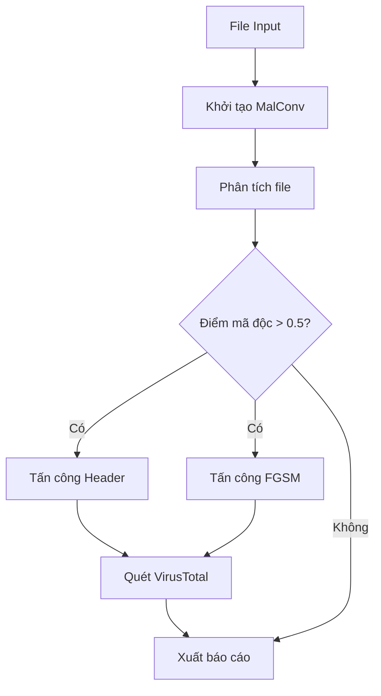

```
███╗   ███╗ █████╗ ██╗     ██████╗ ██████╗ ███╗   ██╗██╗   ██╗
████╗ ████║██╔══██╗██║    ██╔════╝██╔═══██╗████╗  ██║██║   ██║
██╔████╔██║███████║██║    ██║     ██║   ██║██╔██╗ ██║██║   ██║
██║╚██╔╝██║██╔══██║██║    ██║     ██║   ██║██║╚██╗██║╚██╗ ██╔╝
██║ ╚═╝ ██║██║  ██║██║██║  ╚██████╗╚██████╔╝██║ ╚████║ ╚████╔╝ 
╚═╝     ╚═╝╚═╝  ╚═╝╚════╝  ╚═════╝ ╚═════╝ ╚═╝  ╚═══╝  ╚═══╝  
                                                                
╔═══════════════════════════════════════════════════════════════╗
║                     MalConv Analyzer Tool                      ║
║                Advanced Malware Analysis & Evasion             ║
╚═══════════════════════════════════════════════════════════════╝       
```
# MalConv Analyzer Tool

## ⚠️ Cảnh báo về độ nguy hiểm
**CẢNH BÁO**: Tool này làm việc trực tiếp với mã độc thực. Việc sử dụng không đúng cách có thể gây nguy hiểm cho hệ thống của bạn.

- Chỉ sử dụng trong môi trường sandbox cô lập
- Không chạy mã độc trên máy thật
- Đảm bảo không có kết nối internet trực tiếp
- Backup dữ liệu quan trọng trước khi sử dụng

## 🎯 Mục tiêu dự án
1. **Nghiên cứu học thuật**
   - Đánh giá hiệu quả của MalConv trong phát hiện mã độc
   - Phân tích các kỹ thuật né tránh phát hiện
   - Thử nghiệm khả năng phòng thủ của model

2. **Mục đích sử dụng**
   - Chỉ phục vụ mục đích nghiên cứu khoa học
   - Không được sử dụng cho mục đích tấn công
   - Không chịu trách nhiệm về việc lạm dụng tool

## 📁 Cấu trúc dự án
```
MalConv
├── analysis_results
│   ├── fgsm_shell.exe
│   └── header_evasion_shell.exe
├── Example.log
├── malconv_analyzer.py
├── README.md
├── results
│   ├── fgsm_shell.exe
│   └── header_evasion_shell.exe
├── samples
│   ├── calc.exe
│   ├── eicar.com
│   └── shell.exe
└── tests
    ├── blackbox_malconv.py
    ├── malconv_analyzer copy.py
    ├── nevergrad_malconv.py
    └── run.py
```

## Mô tả
MalConv Analyzer là công cụ phân tích mã độc tự động sử dụng mạng neural MalConv kết hợp với các kỹ thuật tấn công né tránh. Tool được thiết kế để:
- Phát hiện mã độc sử dụng deep learning
- Thực hiện các tấn công né tránh
- Tích hợp với VirusTotal để kiểm tra mẫu

## Sơ đồ hoạt động


## Cấu trúc code

### 1. Class MalwareAnalyzer
Class chính quản lý toàn bộ quá trình phân tích

#### Phương thức khởi tạo
```python
def __init__(self, output_folder: str, vt_api_key: str = None, debug: bool = False)
```
- `output_folder`: Thư mục lưu kết quả
- `vt_api_key`: API key của VirusTotal
- `debug`: Bật/tắt chế độ debug

#### Phân tích file
```python
def analyze_file(self, file_path: str) -> Optional[Dict[str, Any]]
```
- Đọc và phân tích file input
- Thực hiện phân loại với MalConv
- Khởi chạy các tấn công nếu là mã độc

### 2. Các phương thức tấn công

#### Tấn công Header
```python
def _perform_header_evasion(self, x: np.ndarray, file_path: str) -> Dict[str, Any]
```
**Tham số:**
- Số lần lặp: 25 #có thể tuỳ chỉnh
- Ngưỡng: 0.1
- Khởi tạo ngẫu nhiên: False

**Công dụng:**
- Sửa đổi PE header để né tránh phát hiện
- Tạo file mới đã được sửa đổi
- Trả về kết quả và đường dẫn file

#### Tấn công FGSM 
```python
def _perform_fgsm_attack(self, x: np.ndarray, file_path: str) -> Dict[str, Any]
```
**Tham số:**
- Bytes padding: 512
- Epsilon: 4.0 
- Số lần lặp: 3 #có thể tuỳ chỉnh

**Công dụng:**
- Thực hiện tấn công gradient
- Tạo file né tránh mới
- Trả về kết quả và đường dẫn

### 3. Tích hợp VirusTotal

#### Kiểm tra file
```python
def _check_virustotal(self, file_path: str) -> Dict
```
**Chức năng:**
- Tính hash của file
- Upload và quét trên VirusTotal
- Phân tích kết quả phát hiện

## Cách sử dụng

### Cài đặt
```bash
# Tạo môi trường
conda create -n malconv python=3.9
conda activate malconv

# Cài đặt dependencies
pip install -r requirements.txt
```

### Chạy tool
```bash
# Giới hạn bộ nhớ 2GB
ulimit -v 2097152

# Chạy phân tích
python malconv_analyzer.py --target-file <file> [options]
```

### Tùy chọn
- `--target-file`: File cần phân tích (bắt buộc)
- `--output-folder`: Thư mục kết quả (mặc định: analysis_results)
- `--vt-api-key`: API key VirusTotal
- `--debug`: Bật log debug

## Kết quả
Tool sẽ tạo báo cáo chi tiết bao gồm:
- Kết quả phân loại MalConv
- Kết quả các tấn công né tránh  
- Kết quả quét VirusTotal
- Đường dẫn tới các file đã tạo

## Lưu ý
- Giới hạn kích thước file < 10MB
- Cần API key VirusTotal để quét online
- Thu gom rác tự động sau mỗi phân tích
- Log được lưu trong thư mục gốc

## 🔒 Yêu cầu môi trường sandbox
### Docker sandbox (Khuyến nghị)
```bash
# Build Docker image
docker build -t malconv-sandbox .

# Chạy container
docker run -it --rm \
  --memory=2g \
  --cpus=2 \
  -v $(pwd)/samples:/samples \
  -v $(pwd)/results:/results \
  malconv-sandbox
```

### VirtualBox sandbox
- OS: Ubuntu 20.04 LTS
- RAM: 2GB
- CPU: 2 cores
- Network: Host-only adapter
- Shared folder: Disabled

## ⚖️ Điều khoản sử dụng
1. Tool này chỉ được sử dụng cho mục đích:
   - Nghiên cứu học thuật
   - Phân tích bảo mật
   - Học tập và giảng dạy

2. Nghiêm cấm sử dụng cho:
   - Tấn công hệ thống
   - Phát tán mã độc
   - Các hoạt động phi pháp

## 🔧 Chi tiết kỹ thuật

### 1. Khởi tạo và Cấu hình
```python
# Cấu hình logging
def setup_logging(debug: bool = False) -> None:
    """Thiết lập logging với timestamp"""
    timestamp = datetime.now().strftime("%Y%m%d_%H%M%S")
    log_file = f'malconv_analysis_{timestamp}.log'
```

### 2. Quy trình Phân tích
1. **Đọc file và tiền xử lý**
   - Kiểm tra định dạng PE
   - Chuyển đổi thành numpy array
   - Chuẩn hóa dữ liệu

2. **Phân loại với MalConv**
   - Score > 0.5: Phân loại là mã độc
   - Score ≤ 0.5: Phân loại là file lành tính

3. **Tấn công né tránh (với mã độc)**
   - Header Evasion Attack:
     - 25 lần lặp
     - Ngưỡng: 0.1
     - Sửa đổi PE header
   
   - FGSM Attack:
     - 512 bytes padding
     - Epsilon: 4.0
     - 3 lần lặp

4. **Quét VirusTotal**
   - File gốc
   - File sau Header Evasion
   - File sau FGSM Attack

### 3. Xử lý Bộ nhớ
```python
def monitor_memory():
    """Giám sát sử dụng bộ nhớ"""
    process = psutil.Process()
    mem_info = process.memory_info()
    print_step(f"Memory Usage: {mem_info.rss / 1024 / 1024:.1f} MB")
```

### 4. Định dạng Báo cáo
```
==================================================
           BÁO CÁO PHÂN TÍCH MÃ ĐỘC           
==================================================
File: [tên file]
Kích thước: [size] KB
Phân loại: [Mã độc/Lành tính]
Điểm tin cậy: [0-1]

VirusTotal (Gốc):
- Phát hiện: [X/Y]
- Ngày quét: [ngày]
- URL báo cáo: [url]

Kết quả Header Evasion:
- Điểm số: [0-1]
- File: [tên file]
- VirusTotal: [X/Y]

Kết quả FGSM:
- Điểm số: [0-1]
- File: [tên file]
- VirusTotal: [X/Y]
==================================================
```

### 5. Xử lý Lỗi
- Kiểm tra định dạng file
- Xử lý timeout VirusTotal
- Quản lý bộ nhớ
- Log lỗi chi tiết


## 📚 Tài liệu tham khảo
1. MalConv paper: [secml-malware: Pentesting Windows Malware Classifiers with
Adversarial EXEmples in Python](https://arxiv.org/pdf/2104.12848v3)
2. secml_malware: [secml_malware](https://github.com/pralab/secml_malware)


## 👥 Đóng góp
Mọi đóng góp đều được chào đón! Vui lòng đọc CONTRIBUTING.md trước khi bắt đầu.

## 👨‍💻 Tác giả
- **Nguyễn Lê Quốc Đạt**
  - Email: datnguyenlequoc2001@gmail.com
  - GitHub: [datnlq](https://github.com/w0rkd4tt)
- **Hoàng Anh Tuấn**

## 🙏 Lời cảm ơn
Chúng tôi xin chân thành cảm ơn:

- Cộng đồng nghiên cứu bảo mật
- Các nhà phát triển đã đóng góp
- Tài liệu tham khảo từ các nguồn mở
- Đặc biệt, các mô hình AI đã hỗ trợ:
  - ChatGPT
  - Claude
  - Grok
  - Gemini
  - Copilot && Cursor

## 📞 Liên hệ
Nếu có câu hỏi hoặc cần hỗ trợ:

- **Email**: datnguyenlequoc2001@gmail.com 
- **Issues**: [GitHub Issues](https://github.com/datnlq/malconv/issues)

## ⚡ Lưu ý quan trọng
> Repository này **chỉ phục vụ mục đích giáo dục**. Người sử dụng hoàn toàn chịu trách nhiệm về việc sử dụng mã nguồn.
