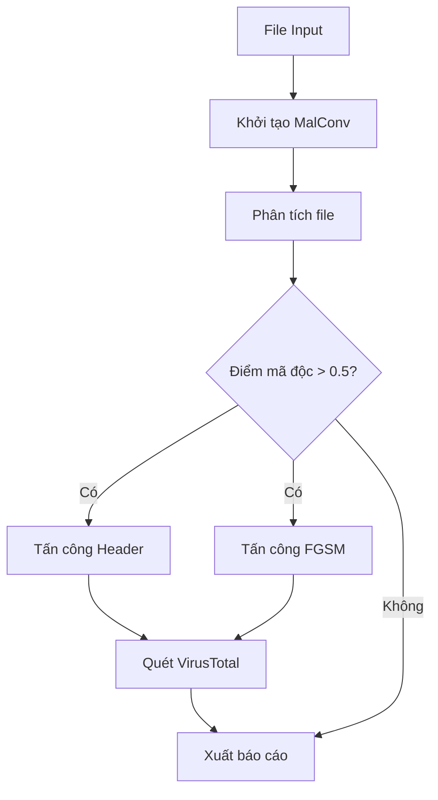

```
███╗   ███╗ █████╗ ██╗     ██████╗ ██████╗ ███╗   ██╗██╗   ██╗
████╗ ████║██╔══██╗██║    ██╔════╝██╔═══██╗████╗  ██║██║   ██║
██╔████╔██║███████║██║    ██║     ██║   ██║██╔██╗ ██║██║   ██║
██║╚██╔╝██║██╔══██║██║    ██║     ██║   ██║██║╚██╗██║╚██╗ ██╔╝
██║ ╚═╝ ██║██║  ██║██║██║  ╚██████╗╚██████╔╝██║ ╚████║ ╚████╔╝ 
╚═╝     ╚═╝╚═╝  ╚═╝╚════╝  ╚═════╝ ╚═════╝ ╚═╝  ╚═══╝  ╚═══╝  
                                                                
╔═══════════════════════════════════════════════════════════════╗
║                     MalConv Analyzer Tool                      ║
║                Advanced Malware Analysis & Evasion             ║
╚═══════════════════════════════════════════════════════════════╝       
```
# MalConv Analyzer Tool

`MalConv Analyzer` là một công cụ phân tích mã độc tự động được thiết kế để kiểm thử và đánh giá khả năng chống chịu của các bộ phân loại mã độc Windows dựa trên `MachineLearning`. Công cụ này sử dụng mạng neural sâu `MalConv` để phân loại tệp thực thi PE và kết hợp với các kỹ thuật tấn công né tránh tiên tiến. Nền tảng cho sự phát triển của công cụ này xuất phát từ các nghiên cứu quan trọng trong lĩnh vực an ninh mạng, vốn đã chỉ ra rằng các hệ thống phát hiện mã độc dựa trên học máy có thể bị đánh lừa bởi các mẫu EXE đối kháng (adversarial EXEmples). Các mẫu này được tạo ra bằng cách áp dụng các thao tác thực tiễn lên tệp thực thi Windows mà vẫn giữ nguyên chức năng ban đầu của mã độc, nhưng làm thay đổi cấu trúc tệp tin theo cách khiến mô hình học máy phân loại sai.

Công cụ này đóng vai trò là một tài nguyên giá trị cho `nghiên cứu học thuật` trong việc đánh giá hiệu quả của MalConv, phân tích sâu hơn các kỹ thuật né tránh phát hiện, và thử nghiệm khả năng phòng thủ của mô hình. Lưu ý rằng tool này làm việc trực tiếp với mã độc thực và chỉ nên được sử dụng trong môi trường sandbox cô lập cho mục đích `nghiên cứu và giáo dục`.

## ⚠️ Cảnh báo về độ nguy hiểm
**CẢNH BÁO**: Tool này làm việc trực tiếp với mã độc thực. Việc sử dụng không đúng cách có thể gây nguy hiểm cho hệ thống của bạn.

- Chỉ sử dụng trong môi trường sandbox cô lập
- Không chạy mã độc trên máy thật #[Sample Malware](http://www.tekdefense.com/downloads/malware-samples)
- Đảm bảo không có kết nối internet trực tiếp
- Backup dữ liệu quan trọng trước khi sử dụng

## 🎯 Mục tiêu dự án
1. **Nghiên cứu học thuật**
   - Đánh giá hiệu quả của MalConv trong phát hiện mã độc
   - Phân tích các kỹ thuật né tránh phát hiện
   - Thử nghiệm khả năng phòng thủ của model

2. **Mục đích sử dụng**
   - Chỉ phục vụ mục đích nghiên cứu khoa học
   - Không được sử dụng cho mục đích tấn công
   - Không chịu trách nhiệm về việc lạm dụng tool

# MalConv Analyzer - Test Scenarios & Evaluation Guide

## 1. Kịch bản phân tích cơ bản

### 1.1 Phân tích file PE thông thường
```bash
python malconv_analyzer.py --target-file samples/benign.exe
```
**Kết quả mong đợi:**
- Điểm số MalConv < 0.5
- Phân loại là "Benign"
- Không thực hiện tấn công né tránh

### 1.2 Phân tích mã độc
```bash
python malconv_analyzer.py --target-file samples/malware.exe
```
**Kết quả mong đợi:**
- Điểm số MalConv > 0.5
- Phân loại là "Malware"
- Tự động thực hiện tấn công né tránh

## 2. Kịch bản tấn công né tránh

### 2.1 Header Evasion Attack
Khi phát hiện là mã độc, tool sẽ:
- Sửa đổi PE header để giảm điểm phát hiện
- Tạo file mới: `analysis_results/header_evasion_[filename].exe`
- Mục tiêu: Điểm số sau tấn công < 0.5

### 2.2 FGSM Attack
Sau header evasion:
- Thực hiện tấn công gradient-based
- Tạo file mới: `analysis_results/fgsm_[filename].exe`
- Mục tiêu: Điểm số sau tấn công < 0.5

## 3. Tích hợp VirusTotal

### 3.1 Quét file gốc
```bash
python malconv_analyzer.py --target-file samples/malware.exe --vt-api-key YOUR_API_KEY
```
**Kiểm tra:**
- Tỷ lệ phát hiện ban đầu
- Số lượng engine phát hiện
- URL báo cáo chi tiết

### 3.2 Quét file sau tấn công
**Đánh giá hiệu quả né tránh:**
- So sánh tỷ lệ phát hiện trước/sau
- Kiểm tra các engine bị bypass
- Xác nhận tính khả thi của tấn công

## 4. Debug Mode

### 4.1 Ghi log chi tiết
```bash
python malconv_analyzer.py --target-file sample.exe --debug
```
**Kiểm tra log:**
- Thông tin hệ thống
- Memory usage
- Chi tiết quá trình phân tích
- Lỗi và exceptions

## 5. Đánh giá hiệu năng

### 5.1 Sử dụng bộ nhớ
- Giới hạn: 2GB RAM
- Monitor qua psutil
- Garbage collection

### 5.2 Thời gian xử lý
**Đo thời gian cho:**
- Phân tích MalConv: ~5-10s
- Header Evasion: ~30-60s
- FGSM Attack: ~20-40s
- VirusTotal scan: phụ thuộc API

## 6. Báo cáo kết quả

### 6.1 Format báo cáo
```
==================================================
           MALWARE ANALYSIS REPORT           
==================================================
File: sample.exe
Size: 250.5 KB
Classification: Malware
Confidence Score: 0.8765

VirusTotal Results (Original):
- Detections: 45/70
- Scan Date: 2025-05-16
- Report URL: https://www.virustotal.com/...

[Chi tiết các cuộc tấn công né tránh]
==================================================
```

### 6.2 Log file (Debug mode)
```
logs/sample.exe_20250516_110035.log
```

## 7. Yêu cầu hệ thống
- Python 3.9+
- 2GB RAM tối thiểu
- VirusTotal API key (optional)
- Môi trường sandbox để test

## 8. Tiêu chí đánh giá thành công
1. **Phân loại chính xác**
   - True Positive Rate > 90%
   - False Positive Rate < 5%

2. **Hiệu quả né tránh**
   - Giảm điểm số MalConv > 50%
   - Giảm tỷ lệ phát hiện VirusTotal > 30%

3. **Hiệu năng**
   - Thời gian phân tích < 2 phút/file
   - Memory usage < 2GB
   - Không crash với file lớn

4. **Logging & Reporting**
   - Log đầy đủ thông tin
   - Báo cáo dễ đọc
   - Có thể trace lỗi

## 📁 Cấu trúc dự án
```
MalConv
├── analysis_results
│   ├── fgsm_shell.exe
│   └── header_evasion_shell.exe
├── Example.log
├── logs
│   ├── 1.exe_20250516_112040.log
│   ├── 854137.exe_20250516_112324.log
│   ├── Bombermania.exe_20250516_105644.log
│   ├── shell.exe_20250516_112410.log
│   └── whatami_20250516_105905.log
├── malconv_analyzer.py
├── README.md
├── results
│   ├── fgsm_shell.exe
│   └── header_evasion_shell.exe
├── samples
│   ├── 1.exe.zip
│   ├── 854137.exe.zip
│   ├── Bombermania.exe.zip
│   ├── eicar.com
│   └── whatami.zip
└── tests
    ├── blackbox_malconv.py
    ├── malconv_analyzer copy.py
    ├── nevergrad_malconv.py
    └── run.py
```

## Mô tả
MalConv Analyzer là công cụ phân tích mã độc tự động sử dụng mạng neural MalConv kết hợp với các kỹ thuật tấn công né tránh. Tool được thiết kế để:
- Phát hiện mã độc sử dụng deep learning
- Thực hiện các tấn công né tránh
- Tích hợp với VirusTotal để kiểm tra mẫu

## Sơ đồ hoạt động

## Cấu trúc code chi tiết

### 1. Core Classes

#### MalwareAnalyzer
```python
class MalwareAnalyzer:
    def __init__(self, output_folder: str, vt_api_key: str = None, debug: bool = False):
        """Khởi tạo analyzer với output directory và VirusTotal API key"""
```

#### Initialization Methods
```python
def _initialize_models(self) -> None:
    """Khởi tạo model MalConv và các thành phần cần thiết"""
    
def initialize_virustotal(self, api_key: str) -> None:
    """Khởi tạo VirusTotal client với API key"""
```

### 2. Analysis Methods

#### Main Analysis
```python
def analyze_file(self, file_path: str) -> Optional[Dict[str, Any]]:
    """
    Phân tích file chính
    Args:
        file_path: Đường dẫn đến file cần phân tích
    Returns:
        Dict chứa kết quả phân tích hoặc None nếu lỗi
    """
```

#### Evasion Attacks
```python
def _perform_header_evasion(self, x: np.ndarray, file_path: str) -> Dict[str, Any]:
    """
    Thực hiện tấn công Header Evasion
    Args:
        x: Input array đã được chuẩn hóa
        file_path: Đường dẫn file gốc
    Returns:
        Dict chứa kết quả và đường dẫn file mới
    Params:
        - iterations: 25 (số lần lặp)
        - threshold: 0.1 (ngưỡng chấp nhận)
        - random_init: False
    """

def _perform_fgsm_attack(self, x: np.ndarray, file_path: str) -> Dict[str, Any]:
    """
    Thực hiện tấn công FGSM
    Args:
        x: Input array đã được chuẩn hóa
        file_path: Đường dẫn file gốc
    Returns:
        Dict chứa kết quả và đường dẫn file mới
    Params:
        - padding: 512 bytes
        - epsilon: 4.0
        - iterations: 3
    """
```

### 3. VirusTotal Integration

#### API Methods
```python
async def _check_virustotal_async(self, file_path: str) -> Dict:
    """
    Kiểm tra file với VirusTotal API (async)
    Args:
        file_path: Đường dẫn file cần quét
    Returns:
        Dict chứa kết quả quét
    Timeouts:
        - Get report: 30s
        - Upload file: 60s
        - Analysis check: 5s/lần
    """

def _check_virustotal(self, file_path: str) -> Dict:
    """Wrapper đồng bộ cho _check_virustotal_async"""
```

### 4. Utility Functions

#### File Processing
```python
def _get_file_hash(self, file_path: str) -> str:
    """
    Tính SHA256 hash của file
    Args:
        file_path: Đường dẫn file
    Returns:
        Chuỗi hash SHA256
    """

def _parse_vt_report(self, report) -> Dict:
    """
    Parse kết quả từ VirusTotal
    Args:
        report: JSON response từ VT API
    Returns:
        Dict với thông tin đã được format
    """
```

#### Logging & Reporting
```python
def setup_logging(target_file: str, output_folder: str = "analysis_results", debug: bool = False) -> None:
    """
    Thiết lập logging system
    Args:
        target_file: Tên file được phân tích
        output_folder: Thư mục chứa log
        debug: Bật/tắt chế độ debug
    Format:
        Debug: '%(asctime)s - %(levelname)s - [%(filename)s:%(lineno)d] - %(message)s'
        Info: '%(message)s'
    """

def print_analysis_report(self, result: Dict[str, Any]) -> None:
    """
    In báo cáo phân tích chi tiết
    Args:
        result: Dict chứa kết quả phân tích
    Sections:
        - Thông tin file
        - Kết quả MalConv
        - Kết quả tấn công né tránh
        - Kết quả VirusTotal
    """
```

### 5. Memory Management
```python
def monitor_memory() -> None:
    """
    Giám sát sử dụng bộ nhớ
    Returns:
        None, in thông tin qua print_step
    Monitors:
        - RSS (Resident Set Size)
        - Virtual Memory
        - Swap usage
    """
```

## Cách sử dụng

### Cài đặt
```bash
# Tạo môi trường
conda create -n malconv python=3.9
conda activate malconv

# Cài đặt dependencies
pip install -r requirements.txt
```

### Chạy tool
```bash
# Giới hạn bộ nhớ 2GB
ulimit -v 2097152

# Chạy phân tích
python malconv_analyzer.py --target-file <file> [options]
```

### Tùy chọn
- `--target-file`: File cần phân tích (bắt buộc)
- `--output-folder`: Thư mục kết quả (mặc định: analysis_results)
- `--vt-api-key`: API key VirusTotal
- `--debug`: Bật log debug

## Kết quả
Tool sẽ tạo báo cáo chi tiết bao gồm:
- Kết quả phân loại MalConv
- Kết quả các tấn công né tránh  
- Kết quả quét VirusTotal
- Đường dẫn tới các file đã tạo

## Lưu ý
- Giới hạn kích thước file < 10MB
- Cần API key VirusTotal để quét online
- Thu gom rác tự động sau mỗi phân tích
- Log được lưu trong thư mục gốc

## 🔒 Yêu cầu môi trường sandbox
### Docker sandbox (Khuyến nghị)
```bash
# Build Docker image
docker build -t malconv-sandbox .

# Chạy container
docker run -it --rm \
  --memory=2g \
  --cpus=2 \
  -v $(pwd)/samples:/samples \
  -v $(pwd)/results:/results \
  malconv-sandbox
```

### VirtualBox sandbox
- OS: Ubuntu 20.04 LTS
- RAM: 2GB
- CPU: 2 cores
- Network: Host-only adapter
- Shared folder: Disabled

## ⚖️ Điều khoản sử dụng
1. Tool này chỉ được sử dụng cho mục đích:
   - Nghiên cứu học thuật
   - Phân tích bảo mật
   - Học tập và giảng dạy

2. Nghiêm cấm sử dụng cho:
   - Tấn công hệ thống
   - Phát tán mã độc
   - Các hoạt động phi pháp

## 📚 Tài liệu tham khảo
1. MalConv paper: [secml-malware: Pentesting Windows Malware Classifiers with
Adversarial EXEmples in Python](https://arxiv.org/pdf/2104.12848v3)
2. secml_malware: [secml_malware](https://github.com/pralab/secml_malware)


## 👥 Đóng góp
Mọi đóng góp đều được chào đón! Vui lòng đọc CONTRIBUTING.md trước khi bắt đầu.

## 👨‍💻 Tác giả
- **Nguyễn Lê Quốc Đạt**
  - Email: datnguyenlequoc2001@gmail.com
  - GitHub: [w0rkkd4tt](https://github.com/w0rkd4tt)
- **Hoàng Anh Tuấn**

## 🙏 Lời cảm ơn
Chúng tôi xin chân thành cảm ơn:

- Cộng đồng nghiên cứu bảo mật
- Các nhà phát triển đã đóng góp
- Tài liệu tham khảo từ các nguồn mở
- Đặc biệt, các mô hình AI đã hỗ trợ:
  - ChatGPT
  - Claude
  - Grok
  - Gemini
  - Copilot && Cursor

## 📞 Liên hệ
Nếu có câu hỏi hoặc cần hỗ trợ:

- **Email**: datnguyenlequoc2001@gmail.com 
- **Issues**: [GitHub Issues](https://github.com/w0rkd4tt/MalConv/issues)

## ⚡ Lưu ý quan trọng
> Repository này **chỉ phục vụ mục đích giáo dục**. Người sử dụng hoàn toàn chịu trách nhiệm về việc sử dụng mã nguồn.
